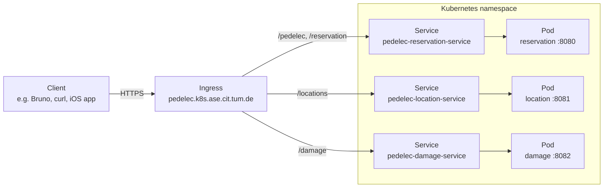

# Architecture

Pedelec is a small three-service system that runs on the server side. We use it as a running example throughout the workshop because it's complex enough to need Kubernetes (multiple deployable units, ingress fan-out) and simple enough to fit in your head.

## Services

| Service | Port | Responsibility |
|---|---|---|
| `reservation` | `8080` | Tracks pedelecs (e-bikes) and reservations against them. |
| `location` | `8081` | Stores current GPS coordinates per pedelec. |
| `damage` | `8082` | Records damage reports per pedelec. |

All three are stateless Go binaries built with Gin. There's no database — each service keeps an in-memory mock dataset, which is plenty for teaching Kubernetes concepts without dragging in stateful workloads.

## Request flow



## How the URL paths map to services

| URL path prefix | Routed to | Why |
|---|---|---|
| `/pedelec` | reservation | Pedelec metadata lives with the reservation service. |
| `/reservation` | reservation | Reservation CRUD. |
| `/locations` | location | Lat/lng lookup and update. |
| `/damage` | damage | Damage report CRUD. |

Path-based fan-out from a single ingress host is one of the things the workshop is designed to make tangible — students see how an HTTP path becomes a routing decision in YAML.

## Container images

The three services are published to GitHub Container Registry by `.github/workflows/build-and-publish.yml`:

```
ghcr.io/<owner>/pedelec-damage:latest
ghcr.io/<owner>/pedelec-location:latest
ghcr.io/<owner>/pedelec-reservation:latest
```

`<owner>` is the GitHub username/org that hosts the fork — for the upstream repo it's `mtze`. The K8s manifests and Helm chart in this repo default to `mtze`; if you forked and want to deploy your own builds, retarget as described in each exercise README.
